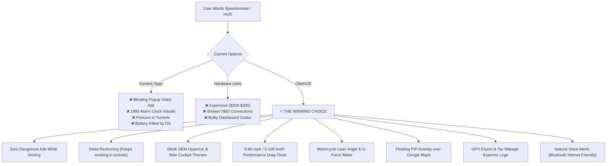

# OdoHUD: Competitive Analysis & Killer Features Roadmap 🚀

---

## 1. Executive Summary

Most existing speedometer and Head-Up Display (HUD) applications on Google Play and Apple App Store were conceived between 2011 and 2016. While they fulfill basic GPS velocity tracking, they are severely bogged down by:
1. **Intrusive, life-threatening advertising** (full-screen video popups triggering while driving at highway speeds).
2. **Dated 1990s LCD aesthetics** that look like vintage digital alarm clocks rather than modern digital cockpits.
3. **Total failure in tunnels, parking garages, and urban canyons** (freezing or plummeting to 0 km/h).
4. **Windshield ghosting & double reflections** on laminated automotive glass.
5. **Complete disregard for motorcycle riders** (no lean angle tracking, no glove-friendly interfaces).
6. **No performance metrics** (0–60 mph, 0–100 km/h launch timers).

**OdoHUD** already possesses a superior engineering foundation:
- Fixed-width monospaced tabular numerals (`FontFeature.tabularFigures()`) to prevent numeral shaking.
- Matrix4 3D horizontal windshield mirroring (`scale(-1, 1, 1)`).
- Stationary GPS noise gate ($< 1.5$ km/h or accuracy $> 20$ m suppressed to 0.0 to prevent traffic-light drift).
- Low-power persistent foreground service with live notification tray telemetry.
- 4-step OEM battery optimization exemption wizard (Xiaomi HyperOS, Samsung OneUI, OnePlus, Huawei).
- Glove-safe 1500 ms haptic hold-to-reset.
- Embedded local persistence via Isar Database.

By capitalizing on the competitors' weaknesses and introducing high-value, enthusiast-grade capabilities, OdoHUD can capture commuters, commercial drivers, motorcyclists, and automotive enthusiasts alike.

---

## 2. Competitive Landscape Teardown

| Competitor App | Target Audience | Key Strengths | Critical Shortcomings & User Complaints |
| :--- | :--- | :--- | :--- |
| **DigiHUD / DigiHUD Pro** | General commuters, truck drivers | Lightweight, low battery draw, floating window mode. | • Looks like a 1980s green digital watch. • Prone to AMOLED screen burn-in (static digits). • No voice alerts; sound alerts are harsh piezo beeps. • No GPX route export in standard tiers. • Freezes or fails in tunnels and underpasses. |
| **Speedometer 55 GPS** | iOS commuters, speed trap monitoring | Black-box 20-min flight recorder, configurable alarms. | • iOS-centric; poor/absent Android parity. • Cluttered, overwhelming UI with confusing cost calculators. • Aggressive paywalls and in-app purchase nags. • No lean angle or bike telemetry. |
| **GPS Speedometer & Odometer** *(Smart Mobile Tools & generic clones)* | Casual drivers with broken dashboard speedos | High search ranking, multiple analog gauge faces. | • **Dangerous full-screen video ads** pop up while vehicle is in motion. • Clunky, skeuomorphic 2012 dials with jittery needles. • Aggressive battery drain; OS kills app in background. • Inaccurate trip distances due to stationary GPS drift at stoplights. |
| **HUDWAY Go / HUDWAY Drive** | Tech-forward night drivers, HUD fans | Dedicated windshield projection, turn-by-turn HUD. | • Pushes expensive (\$300) hardware with poor customer support. • App crashes frequently, sluggish GPS refresh rate. • Requires expensive subscriptions for offline navigation. |
| **Pirelli Diablo Super Biker / Calimoto** | Motorcyclists, track day riders | Lean angle measurement, cornering telemetry. | • Primarily track/twisties route planners, not an everyday HUD/speedometer. • Heavy battery drain, complex setup required. • Cluttered UI, unsuited for night dashboard projection. |
| **Sygic GPS Navigation (HUD Mode)** | Navigational commuters | Sleek visuals, turn-by-turn guidance. | • HUD mode locked behind expensive subscription. • Heavy resource hog (device overheats on dashboards). • No motorcycle or performance drag timer features. |

---

## 3. What Existing Apps Are NOT Doing Well (User Pain Points)

### 🚨 1. Life-Threatening Full-Screen Ads While Driving
The #1 complaint across top-rated Play Store speedometer apps is ads popping up while the user is actively driving. This is not only annoying—it is a critical road safety hazard.
> **The OdoHUD Opportunity:** Clean, ad-free or non-intrusive safety-first design. Zero popup interruptions while vehicle speed $> 0$.

### 🎨 2. Ugly, Archaic "1990s Casio Watch" Visuals
Existing apps feature garish neon greens, jagged 7-segment digital fonts, or low-framerate skeuomorphic needles. Modern cars and bikes have sleek digital dashboards (Audi Virtual Cockpit, Porsche Taycan, Tesla UI, Ducati TFT displays).
> **The OdoHUD Opportunity:** Curated OEM Cockpit Themes (e.g. *Bavarian M-Sport*, *Stuttgart Neon*, *Bologna Redline*, *Cyberpunk Stealth*) with smooth gradient arcs and modern typography.

### 🚇 3. The "Tunnel & Urban Canyon" Blind Spot (GPS Signal Loss)
When entering a tunnel, underpass, parking garage, or downtown skyscraper canyon, GPS drops out. Competitor apps instantly drop to 0 km/h, display "NO GPS", or freeze on the last known speed.
> **The OdoHUD Opportunity:** **Dead-Reckoning Fallback Engine**. When GPS accuracy degrades $> 25$ m or signal drops, use device IMU accelerometers and last known speed trajectory to extrapolate speed smoothly for up to 30–60 seconds until satellite lock returns.

### 🪟 4. Windshield "Ghosting" (Double-Image Reflections)
Automotive windshields consist of two bonded glass layers (laminated safety glass). When an ordinary bright screen is placed on the dash, the outer and inner glass reflections create a blurry, double ghost image that causes severe eye fatigue.
> **The OdoHUD Opportunity:** **Anti-Ghosting Optical Mode**. Provide high-contrast, bold stroke-outline typography and customizable vertical chromatic offset settings, plus built-in instructions on anti-reflective film placement.

### ⚖️ 5. No Speedometer Offset / Tire Size Calibration
Under international automotive regulations (UNECE Regulation 39), factory car speedometers are legally forbidden from underreporting speed and typically read 5%–10% higher than actual velocity. Furthermore, aftermarket tires alter speedometer accuracy. Users frequently complain that GPS apps don't match their car's physical speedometer.
> **The OdoHUD Opportunity:** **Speed Calibration Offset**. Let users set an intentional calibration offset (e.g. `+5%` or `+3 km/h`) so the HUD readout mirrors their car's dashboard gauge if desired.

### ⏱️ 6. Missing Performance Enthusiast Tools (0–60 / 0–100 Drag Timer)
Car and motorcycle enthusiasts currently have to download separate expensive or clunky apps (or \$150 Dragy hardware boxes) to test their vehicle's acceleration.
> **The OdoHUD Opportunity:** **Built-in Precision Drag Timer** with automatic zero-speed launch detection:
> - `0–60 mph` / `0–100 km/h`
> - `0–30 mph` / `0–50 km/h` (city launch / e-scooters / mopeds)
> - `100–200 km/h` (highway passing punch)
> - `1/8 mile` and `1/4 mile` elapsed times and trap speed.

### 🏍️ 7. Ignoring Motorcyclists: Lean Angle & Dynamic G-Force
Motorcyclists are the largest demographic mounting phones directly onto handlebars. Yet no leading speedometer app offers live lean angle gauges (degrees left / right bank) or G-force meters.
> **The OdoHUD Opportunity:** **Moto Cockpit Mode**. Leverages phone gyroscopes to display live bank angle (`38° Left`, `42° Right`), max lean per session, and lateral/braking G-force indicators.

### 🪟 8. Lack of Floating Window / Picture-in-Picture (PiP) Overlay
Drivers frequently use Google Maps or Waze for turn-by-turn navigation. Having to choose between navigation and their HUD/speedometer forces them to abandon speedometer apps.
> **The OdoHUD Opportunity:** **Floating Mini HUD Bubble (PiP)** that sits on top of Google Maps / Waze, displaying real-time speed, speed camera warnings, and warning color borders.

### 🗣️ 9. Annoying Buzzer Beeper vs. Intelligent Voice Coaching
Competitors emit ear-piercing piezo beeps when exceeding the speed limit. Drivers and bikers (especially those with Bluetooth helmet intercoms like Cardo or Sena) hate this.
> **The OdoHUD Opportunity:** **Natural Spoken Voice Cues & Bluetooth Audio Routing**:
> - *"Caution: 80 km/h limit exceeded."*
> - *"GPS signal restored."*
> - *"0 to 100 in 4.8 seconds. New personal best!"*

### 💾 10. Data Lock-in: No GPX/KML Route Export or Mileage Tax Logging
Drivers who track mileage for tax write-offs (IRS 1099, business travel, Uber/Lyft), and riders who explore scenic mountain passes, cannot export their trips.
> **The OdoHUD Opportunity:** **One-Tap GPX / KML / CSV Export** for Strava, Google Earth, and tax/expense mileage log reporting.

### 🛡️ 11. AMOLED Screen Burn-in Protection
Placing a phone on a dashboard with bright white/green digits on max brightness for 4+ hours causes permanent burn-in on modern OLED/AMOLED displays.
> **The OdoHUD Opportunity:** **Micro Pixel-Shifter**. Shifts the entire HUD display by 2–4 pixels every 60 seconds (imperceptible to human eyes, but prevents OLED subpixel fatigue).

---

## 4. The Value Proposition: Why Users Will Switch to OdoHUD

---

## 5. Strategic Roadmap & Architectural Implementation

### Phase 1: High-Impact Differentiators (Immediate Wow Factor)
1. **0–60 mph / 0–100 km/h Performance Launch Timer:**
   - Detect vehicle launch automatically from $0.0\text{ km/h}$.
   - High-frequency timer sampling with split intervals (`0-30`, `0-60`, `0-100`).
   - Leaderboard & personal records stored in Isar database.
2. **Motorcycle Lean Angle & Lateral G-Force Gauge:**
   - Integrate `sensors_plus` (gyroscope & accelerometer sensor fusion).
   - Display dynamic bank angle indicator with peak left/right hold for twisty roads.
3. **Speed Calibration Offset Setting:**
   - Setting in `theme_config_record.dart`: `speedOffsetPercent` (e.g. $\pm 10\%$) and `speedOffsetFixed` (e.g. $\pm 5\text{ km/h}$).

### Phase 2: Safety & Resilience (Unbeatable Reliability)
1. **Dead-Reckoning Fallback Engine:**
   - When GPS stream drops accuracy ($> 25\text{ m}$) or times out in tunnels, calculate velocity changes using accelerometer integration damped by rolling rolling resistance.
2. **Spoken Voice Speed Alerts:**
   - Text-to-Speech (`flutter_tts`) routing audio cleanly to vehicle Bluetooth or rider helmet intercoms.
3. **AMOLED Pixel-Shifter Protection:**
   - Periodic 1-pixel cyclic translation every 60 seconds during steady rides.

### Phase 3: Export & Multi-App Workflow (Retention & Utility)
1. **GPX / KML & CSV Mileage Export:**
   - Export recorded trip breadcrumbs to standard GPX for Strava / Relive, and CSV for business mileage deductions.
2. **Floating Picture-in-Picture (PiP) Window:**
   - Floating speed bubble overlay so users can run OdoHUD simultaneously with Google Maps or Waze.
3. **Anti-Ghosting Windshield Optics Mode:**
   - Stroke-only typography with luminance contrast optimization to eliminate double glass reflection.

---
*Created as part of the OdoHUD Product Strategy & Architectural Roadmap.*
